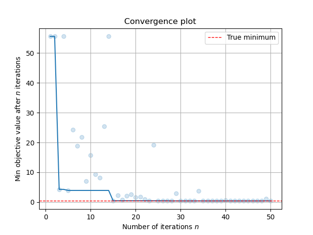
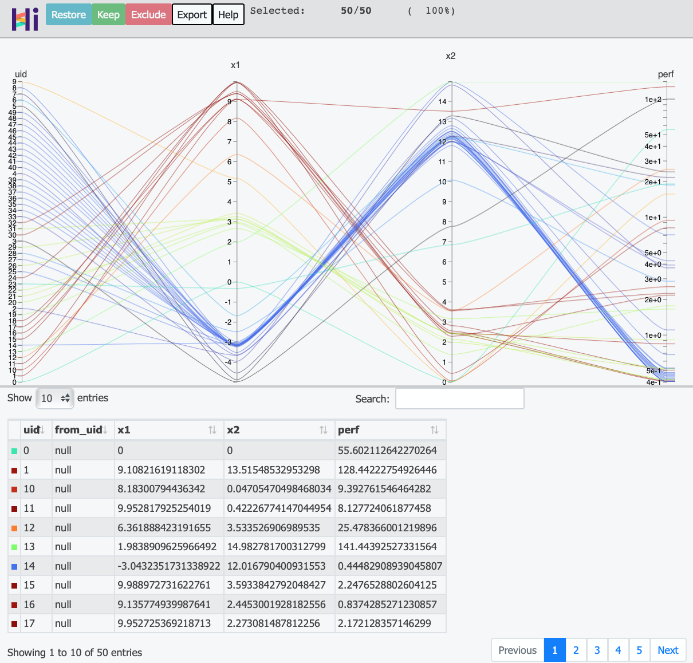

# Quick Start

This tutorial helps you run your first example with **OpenBox**.

the bare markdown will show the image, but with no align or scale:


the html image outside source root is not shown:

<p align="center">

</p>

try html_image in myst-parser (succeed with align and scale):


this syntax extension in MyST will show the image correctly,
but normal markdown user cannot see the picture (e.g. in github):

```{image} ../../../imgs/ab_testing.png
:alt: ab_test
:class: bg-primary
:width: 200px
:align: center
```


try another:

:::{figure-md} fig-target
:class: myclass
:align: center


This is a caption in **Markdown**
:::


$$
f(x)=1
$$

$h(x)=3$

$$
g(x)=2
$$

www.baidu.com

## Define Configuration Space

First, define a configuration space using **ConfigSpace** for searching.

```python
from openbox.utils.config_space import ConfigurationSpace, UniformFloatHyperparameter

# Define Configuration Space
config_space = ConfigurationSpace()
x1 = UniformFloatHyperparameter("x1", -5, 10, default_value=0)
x2 = UniformFloatHyperparameter("x2", 0, 15, default_value=0)
config_space.add_hyperparameters([x1, x2])
```

In this example, we create a **ConfigurationSpace** then add two **UniformFloatHyperparameter** into it.
The parameter **x1** ranges from -5 to 10. The parameter **x2** ranges from 0 to 15.

Other types of hyperparameter are also supported in **ConfigSpace**.
Here are examples of how to define **Integer** and **Categorical** hyperparameters:

```python
from openbox.utils.config_space import UniformIntegerHyperparameter, CategoricalHyperparameter

i = UniformIntegerHyperparameter("i", 0, 100) 
kernel = CategoricalHyperparameter("kernel", ["rbf", "poly", "sigmoid"], default_value="rbf")
```

For advanced usage of **ConfigSpace**, please refer to [ConfigSpace’s documentation](https://automl.github.io/ConfigSpace/master/index.html).

## Define Objective Function

Second, define the objective function to be optimized.
Note that **OpenBox** aims to <font color=#FF0000>**minimize**</font> the objective function.
Here we use the **Branin** function.

```python
import numpy as np
from openbox.utils.config_space import Configuration

# Define Objective Function
def branin(config: Configuration):
    # convert Configuration to dict
    config_dict = config.get_dictionary()
    x1 = config_dict['x1']
    x2 = config_dict['x2']

    # calculate
    a = 1.
    b = 5.1 / (4. * np.pi ** 2)
    c = 5. / np.pi
    r = 6.
    s = 10.
    t = 1. / (8. * np.pi)
    y = a * (x2 - b * x1 ** 2 + c * x1 - r) ** 2 + s * (1 - t) * np.cos(x1) + s

    # return result dictionary
    ret = dict(
        objs=(y, )
    )
    return ret
```

The input of the objective function is a **Configuration** object sampled from **ConfigurationSpace**
as we defined above.
Call <font color=#FF0000>**config.get_dictionary()**</font> to covert **Configuration** to Python **dict** form.

After evaluation, the objective function should return a <font color=#FF0000>**dict (Recommended)**.</font>
The result dict should contain:

+ **'objs'**: A **list/tuple** of **objective values (to be minimized)**. 
In the example above, we have one objective so return a tuple contains a single value.

+ **'constraints**': A **list/tuple** of **constraint values**.
If the problem is not constrained, return **None** or do not include this key in the dict.
Constraints less than zero (**"<=0"**) implies feasibility.

In addition to the recommended usage, for single objective problem with no constraint,
just return a single value is supported, too.

## Run Optimization

After we define the configuration space and the objective function, we could run optimization process,
search over the configuration space and try to find <font color=#FF0000>**minimum**</font> value of the objective.

```python
from openbox.optimizer.generic_smbo import SMBO

# Run Optimization
bo = SMBO(branin,
          config_space,
          num_objs=1,
          num_constraints=0,
          max_runs=50,
          surrogate_type='gp',
          time_limit_per_trial=180,
          task_id='quick_start')
history = bo.run()
```

Here we simply create a <font color=#FF0000>**SMBO**</font> object, passing the objective function **branin** and the 
configuration space **config_space** to it. 

+ **num_objs=1** and **num_constraints=0** indicates our branin function returns a single objective value with no 
constraint. 

+ **max_runs=50** means the optimization will take 50 rounds (50 times of objective function evaluation). 

+ **surrogate_type='gp'**. For mathematical problem, we suggest using Gaussian Process (**'gp'**) as Bayesian surrogate
model. For practical problems such as hyperparameter optimization (HPO), we suggest using Random Forest (**'prf'**).

+ **time_limit_per_trial** sets the time budget (seconds) of each objective function evaluation. Once the 
evaluation time exceeds this limit, objective function will return as a failed trial.

+ **task_id** is set to identify the optimization process.

Then, call <font color=#FF0000>**bo.run()**</font> to start the optimization process and wait for the result to return.

## Observe Optimization Results

At the end of the previous stage, **bo.run()** returns the optimization history. Call 
<font color=#FF0000>**bo.get_history()**</font> will also get the history.

Call <font color=#FF0000>**print(history)**</font> to see the result:

```python
print(history)
```

```
+---------------------------------------------+
| Parameters              | Optimal Value     |
+-------------------------+-------------------+
| x1                      | -3.138277         |
| x2                      | 12.254526         |
+-------------------------+-------------------+
| Optimal Objective Value | 0.398096578033325 |
+-------------------------+-------------------+
| Num Configs             | 50                |
+-------------------------+-------------------+
```

Call <font color=#FF0000>**history.plot_convergence()**</font> to see the optimization process
(you may need to call **plt.show()** to see the graph):

```python
history.plot_convergence(true_minimum=0.397887)
```



In Jupyter Notebook environment, call <font color=#FF0000>**history.visualize_jupyter()**</font> to visualization of 
trials using **hiplot**:

```python
history.visualize_jupyter()
```



